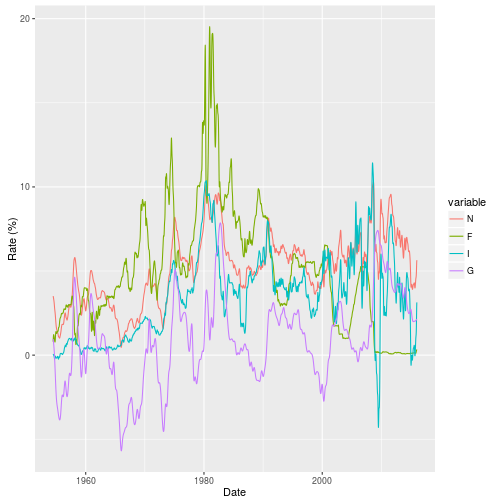

## Taylor Rule Calculator

This presentation is a project assignment for the Coursera Developing Data Products class. The tool presented here should NOT be used for any purpose in its present form. 

The shinyapp is an online calculator the computes and displays the Taylor rule using data downloaded from [FRED](https://fred.stlouisfed.org/). The taylor rule equation is: 

$$  N = I + E + i(T – I) + o(\log(P) – \log(O)) $$

### Variables 
* N - Suggested nominal interest rate. The after inflation zero risk return for renting money. Usually 2 or 3%. 

* I - Current interest rate. Taylor used the year over year GDP deflator, but I'm using the year over year CPI differential. I think CPI is a better indicator of inflation for technical reasons having to do with basket of good changes. CPI based inflation is normally about 1% higher than deflator inflation. 

* i - inflation coefficient. This is a measured quantity that is estimated at about .5. 

---
## More Varibles

* T - Target inflation rate. Most economists agree that inflation in the 2%-3% range decreases friction in labor markets without overly interfering with price indicators. With 0 inflation, people in shrinking industries would have to take wage cuts, which they would hate. With high inflation, everybody becomes too interested in getting rid of cash to do more productive work. 

* o - output coefficient. Another measured coefficient. Estimated at between 0 and .5.

* P - Potential output. The feds best guess at what the economy could produce at full capacity. If GDP is more than P, then we will see strong inflationary forces and producers compete for resources. Pulled from FRED.  

* O - Current output (GDP).  Total output of goods and services.  Pulled from FRED. 

* F - The actual federal funds rate. Pulled from FRED. 

---
## Kicking off the application 

The URL for the application is: 

https://evaitl.shinyapps.io/taylor/

The page lets you pick input parameters, adjust estimated parameters, set a date range, and plot the various series described above. 

--- 
## Example plot:
An example plot with all of the options set would look like this: 

---
## Why have a rule?

> "To fight this recession the Fed needs more than a snapback; it
> needs soaring household spending to offset moribund business
> investment. And to do that, as Paul McCulley of Pimco put it, Alan
> Greenspan needs to create a housing bubble to replace the Nasdaq
> bubble."
> 
> — Paul Krugman (2002)

Central bankers, like everybody else, can become complacent and overly discount risks. Even though he was being egged on by people like this liberal Keynesian hack, Greenspan should have stuck to the Taylor rule after the 2001 recession. Holding rates too low for too long excerbated the housing bubble, which came crashing down in 2008. 

